# Bluepaws V4 Collar Runtime Decisions

Status: working design, suitable for prototype firmware.

Hardware target: RAKwireless RAK4631/WisMesh Board 1 testbed using the RAK4630 module family: Nordic nRF52840 MCU, Semtech SX1262 LoRa radio, BLE, and an external LTE/GNSS modem path for the final collar design.

PlatformIO note: the `collar` environment now uses the `wiscore_rak4631` board definition. Because that board is not always bundled with PlatformIO's default Nordic platform install, the repo carries the small RAKwireless board/variant support files under `rakwireless/`. These are project-local board-support files, not Bluepaws protocol code.

## Terminology

The collar sends one canonical payload: the Bluepaws TLV v1.2 binary packet.

- Private LoRa path: collar sends raw binary TLV to the Home Hub.
- Home Hub cloud path: Home Hub base64-encodes the unchanged collar TLV and wraps it in the HTTPS JSON envelope.
- Cellular direct path: collar sends the same TLV payload through LTE in the HTTPS JSON envelope.

No JSON is sent over the collar-to-hub LoRa radio path.

## Testbed versus production data

The RAK4631 bench firmware may use spoof GNSS while the final collar PCB and real GNSS/modem wiring are still being developed. This is compile-time guarded by:

- `BLUEPAWS_TESTBED_BUILD`
- `BLUEPAWS_GNSS_SPOOF_ENABLED`

The default `collar` PlatformIO environment currently enables both flags because this branch is for hardware bring-up and profile validation. Production builds must disable them.

Important rule: spoof/testbed state is not added as a TLV field. The TLV protocol stays production-shaped so the hub, Edge Function and frontend are tested against the same packet contract. Testbed status is visible through firmware build flags, serial logs and documentation, not by polluting the authenticated collar payload.

### RAK4631 testbed serial console

When `BLUEPAWS_TESTBED_BUILD` is enabled, the collar exposes a non-persistent USB Serial debug console at `115200` baud. This is for bench bring-up only and must not become a production user command channel.

Supported commands:

| Command | Effect |
|---|---|
| `help` | Print available commands. |
| `status` | Print device ID, current profile, debug cadence, sequence and cycle counters. |
| `profile normal` | Switch to `NORMAL`. |
| `profile powersave` | Switch to `POWER_SAVE`. |
| `profile active` | Switch to `ACTIVE`. |
| `profile lost` | Switch to `LOST_ALERT`. |
| `profile debug` | Switch to development-only `DEBUG` profile. |
| `debug on` | Override non-lost sleep cadence to 60 seconds and request the next cycle. |
| `debug off` | Restore the selected profile's normal sleep cadence. |
| `interval <seconds>` | Override non-lost sleep cadence to a custom 5–3600 second interval. |
| `tx` | Request the next collar cycle immediately. |

The `DEBUG` power profile is a real TLV profile code (`power_profile = 4`) for end-to-end bench testing. Debug cadence is separate: it is deliberately an override on top of the selected profile. For example, `profile normal` plus `interval 30` keeps Normal profile semantics but wakes every 30 seconds for bench testing.

The `tx` command mirrors the prototype short-button press: it queues a user-requested report using `tx_reason = INTERRUPT`.

Current spoof origin:

- Latitude: `51.905978580906705`
- Longitude: `-2.239429400113001`
- Drift radius: up to approximately `300 m`

## Power profiles

| Profile | Intended use | Wake interval | Home LoRa check-in | Home GNSS sanity refresh | Scheduled LTE heartbeat | Failed LoRa cycles before LTE |
|---|---:|---:|---:|---:|---:|---:|
| `POWER_SAVE` | Manual battery saving, low battery, or future “mostly home” automation | 30 min | Every 2 BLE-home wakes | Every 10 BLE-home wakes | Every 3 hours | 3 |
| `NORMAL` | Default everyday collar behaviour | 10 min | Every BLE-home wake | Every 10 BLE-home wakes | Every 1 hour | 3 |
| `ACTIVE` | Higher-frequency monitoring, not an emergency mode | 60 sec | Every BLE-home wake | Every 10 BLE-home wakes | Every 10 min | 2 |
| `DEBUG` | Development-only noisy bench-test mode | 30 sec | Every BLE-home wake | Every BLE-home wake | Every 30 sec | 1 |
| `LOST_ALERT` | Temporary emergency search mode | No normal sleep cadence | Separate emergency cadence | Continuous/aggressive where practical | Every minute | 1 |

`DEBUG` is for firmware and pipeline development only. It is intentionally noisy, should not be exposed as a normal customer control, and must not be confused with `LOST_ALERT` safety behaviour.

`LOST_ALERT` is deliberately expensive. It should be temporary and user-triggered during active search, then auto-revert to a safer profile after a fixed safety timeout.

## Runtime flow

```mermaid
stateDiagram-v2
  [*] --> LoadPersistedConfig
  LoadPersistedConfig --> BootReport
  BootReport --> BootBleScan: scan Home beacon
  BootBleScan --> BootGnss: try GNSS up to 60s, even if Home seen
  BootGnss --> SendBoot: tx_reason = BOOT
  SendBoot --> CommandWindow: 15s LoRa ACK/command RX
  SendBoot --> BootLtePost: same TLV via LTE HTTPS wrapper
  BootLtePost --> Sleep

  Sleep --> ButtonShort: user short press
  ButtonShort --> ForcedReport: tx_reason = INTERRUPT
  ForcedReport --> CommandWindow

  Sleep --> ButtonLong: user long press
  ButtonLong --> LostAlert: toggle LOST_ALERT

  Sleep --> Wake: RTC/profile interval
  Wake --> BLEHomeScan: scan for Home Hub beacon

  BLEHomeScan --> HomePath: BLE home beacon seen
  BLEHomeScan --> MissedHomeOne: first missed beacon
  MissedHomeOne --> Sleep: one miss only, do not mark away
  MissedHomeOne --> AwayPath: second consecutive miss

  HomePath --> WakeCheckinDue: profile home check-in cadence due
  WakeCheckinDue --> SendWakeCheckin: tx_reason = WAKE_CHECKIN + HOME_BEACON_SEEN
  SendWakeCheckin --> CommandWindow: 15s LoRa ACK/command RX

  HomePath --> HomeGnssDue: every N BLE-home wakes
  HomeGnssDue --> AcquireGnss: sanity refresh
  AcquireGnss --> HomeTelemetry: fix acquired, status remains HOME
  AcquireGnss --> HomeGnssFailure: fix failed indoors
  HomeGnssFailure --> KeepLastKnown: set stale/error flags; do not erase coordinates

  HomePath --> LteHeartbeatDue: time-based LTE heartbeat
  LteHeartbeatDue --> CellularSend: send same TLV via HTTPS wrapper

  AwayPath --> AwakeLookingCheckin: optional lightweight awake/looking packet
  AwakeLookingCheckin --> AcquireGnss
  AcquireGnss --> LoRaTelemetry: normal telemetry when GNSS usable
  LoRaTelemetry --> CommandWindow: 15s LoRa receipt ACK/commands
  CommandWindow --> CellularFallback: if ACK missing or heartbeat due
  CellularFallback --> Sleep
  CommandWindow --> Sleep

  Wake --> LostAlert: user command/profile says LOST_ALERT
  LostAlert --> BleLostBeacon: advertise BLE lost/find beacon
  LostAlert --> LoRaTelemetry: aggressive reporting
  LostAlert --> CellularSend: frequent redundant LTE path
  LostAlert --> Sleep: timeout or user clears alert
```

## Boot report behaviour

On every cold boot, reboot, watchdog recovery or firmware restart, the collar must:

1. Load persisted collar configuration before choosing its operating behaviour.
2. Attempt a BLE Home scan.
3. Attempt GNSS acquisition for up to 60 seconds, even if the BLE Home beacon is seen.
4. Send a LoRa TLV report with `tx_reason = BOOT`.
5. Open the normal 15-second receipt-ACK and command receive window.
6. Queue the same boot TLV for LTE direct-to-cloud POST.

If GNSS succeeds, the boot report includes valid coordinates. If GNSS fails, the boot report remains valid and useful: set stale/error indicators, include diagnostics, and let the backend update presence/last-seen without moving or erasing the last known map position.

Boot diagnostics use existing TLVs only:

- `firmware_version`
- `reset_reason`
- `uptime_s`

Do not repurpose header flags for extra boot diagnostics. Additional boot/config diagnostics should be future TLVs or a later protocol version.

## BLE Home behaviour

BLE Home detection is primarily a power-saving and state-confidence mechanism.

When the collar sees the trusted Home Hub BLE beacon:

1. It increments the consecutive BLE-home wake counter.
2. It sends a lightweight LoRa wake check-in according to the current profile.
3. It opens the 15-second LoRa receipt-ACK and command receive window.
4. It avoids routine GNSS/LTE on most wakes.
5. It occasionally performs a GNSS sanity refresh according to the current profile.
6. It performs LTE heartbeat by elapsed time, not by BLE-home wake count.

Every report expects a separate immediate hub receipt ACK. If it is absent after
two seconds, the collar retries the exact packet once after a short random
backoff. Only a complete two-attempt failure increments the consecutive failure
counter. A matching ACK resets the counter. Reaching the profile threshold queues
an LTE copy and resets the counter, so a long RF outage causes bounded periodic
fallback rather than prepaid LTE use on every wake. Scheduled LTE ratios and
elapsed-time Home heartbeats continue independently even when LoRa is healthy.

`WAKE_CHECKIN` does not automatically mutate any packet fields. The firmware path that chooses wake check-in explicitly sets `tx_reason = WAKE_CHECKIN` and `HOME_BEACON_SEEN`.

## GNSS failure while home

If BLE Home is seen and a scheduled GNSS sanity refresh fails:

- Keep `status = HOME`.
- Do not erase the last known position.
- Set stale/error flags where appropriate.
- Treat this as low concern because indoor GNSS failure is expected.

The customer-facing map should continue showing the last useful position with updated last-seen/presence rather than jumping to null or implying the cat has moved.

The same rule applies to no-GNSS `BOOT` and `WAKE_CHECKIN` packets: they are presence/diagnostic reports first, not position updates.

## Conservative persistence

The collar persists a small versioned state record in non-volatile flash. This is not a high-frequency event log.

Persist immediately:

- selected power profile;
- device configuration revision;
- LTE/APN/provisioning settings;
- Lost Alert active/inactive state;
- first/meaningful last valid GNSS fix.

Checkpoint carefully:

- message sequence;
- boot counter;
- runtime cycle counters;
- BLE-home wake counters.

The initial policy checkpoints sequence/cycle state periodically rather than after every packet to reduce flash wear. On reboot, the collar resumes from the most recent checkpoint where practical rather than starting from zero.

## Physical button behaviour

Prototype and field-test firmware keeps the collar button enabled:

- short press: force a user-requested report/check-in using `tx_reason = INTERRUPT`;
- long press: toggle `LOST_ALERT`;
- very long press/factory reset: deliberately not part of this milestone to avoid accidental destructive actions.

Both actions must emit clear serial logs and LED feedback. Production UX can refine timings and safety prompts later.

## Lost Alert BLE behaviour

In `LOST_ALERT`, the collar actively advertises a BLE lost/find beacon. A portable/off-grid Home Hub can use the beacon RSSI for close-range finding when GNSS is only accurate to a few metres.

`ACTIVE` does not start the BLE find beacon. Active is higher-frequency monitoring, not emergency search.

Early firmware may advertise a stable device identifier for development. Production should later move to privacy-preserving rotating identifiers before customer release.

## Open items for final hardware

- Replace spoof GNSS with real GM02SP GNSS parsing.
- Implement real battery measurement.
- Tune the implemented LoRa receipt timeout, retry count and profile LTE-fallback thresholds after range/current tests.
- Authenticate hub-to-collar receipt ACKs and commands, with replay protection, before treating downlinks or ACK-driven power decisions as production-secure.
- Decide final user-facing rules for automatic profile changes.
- Validate deep sleep current on the final collar PCB.
