# Bluepaws V4 Collar Runtime Decisions

Status: working design, suitable for prototype firmware.

Hardware target: RAKwireless RAK4631/WisMesh Board 1 testbed using the RAK4630 module family: Nordic nRF52840 MCU, Semtech SX1262 LoRa radio, BLE, and an external LTE/GNSS modem path for the final collar design.

PlatformIO note: the `collar` environment now uses the `wiscore_rak4631` board definition. Because that board is not always bundled with PlatformIO's default Nordic platform install, the repo carries the small RAKwireless board/variant support files under `rakwireless/`. These are project-local board-support files, not Bluepaws protocol code.

## Terminology

The collar sends one canonical payload: the Bluepaws TLV v1.1 binary packet.

- Private LoRa path: collar sends raw binary TLV to the Home Hub.
- Home Hub cloud path: Home Hub base64-encodes the unchanged collar TLV and wraps it in the HTTPS JSON envelope.
- Cellular direct path: collar sends the same TLV payload through LTE in the HTTPS JSON envelope.

No JSON is sent over the collar-to-hub LoRa radio path.

## Testbed versus production data

The RAK4631 bench firmware may use spoof GNSS while the final collar PCB and real GNSS/modem wiring are still being developed. This is compile-time guarded by:

- `BLUEPAWS_TESTBED_BUILD`
- `BLUEPAWS_GNSS_SPOOF_ENABLED`

The default `collar` PlatformIO environment currently enables both flags because this branch is for hardware bring-up and profile validation. Production builds must disable them.

Important rule: spoof/testbed state is not added as a TLV field. The TLV protocol stays production-shaped so the hub, Edge Function and frontend are tested against the same packet contract. Testbed status is visible through firmware build flags, serial logs and documentation, not by polluting the authenticated collar payload.

Current spoof origin:

- Latitude: `51.905978580906705`
- Longitude: `-2.239429400113001`
- Drift radius: up to approximately `300 m`

## Power profiles

| Profile | Intended use | Wake interval | Home LoRa check-in | Home GNSS sanity refresh | LTE heartbeat |
|---|---:|---:|---:|---:|---:|
| `POWER_SAVE` | Manual battery saving, low battery, or future “mostly home” automation | 30 min | Every 2 BLE-home wakes | Every 10 BLE-home wakes | Every 3 hours |
| `NORMAL` | Default everyday collar behaviour | 10 min | Every BLE-home wake | Every 10 BLE-home wakes | Every 1 hour |
| `ACTIVE` | Higher-frequency monitoring, not an emergency mode | 60 sec | Every BLE-home wake | Every 10 BLE-home wakes | Every 10 min |
| `LOST_ALERT` | Temporary emergency search mode | No normal sleep cadence | Separate emergency cadence | Continuous/aggressive where practical | Frequent fallback |

`LOST_ALERT` is deliberately expensive. It should be temporary and user-triggered during active search, then auto-revert to a safer profile after a fixed safety timeout.

## Runtime flow

```mermaid
stateDiagram-v2
  [*] --> Sleep
  Sleep --> Wake: RTC/profile interval
  Wake --> BLEHomeScan: scan for Home Hub beacon

  BLEHomeScan --> HomePath: BLE home beacon seen
  BLEHomeScan --> MissedHomeOne: first missed beacon
  MissedHomeOne --> Sleep: one miss only, do not mark away
  MissedHomeOne --> AwayPath: second consecutive miss

  HomePath --> WakeCheckinDue: profile home check-in cadence due
  WakeCheckinDue --> SendWakeCheckin: tx_reason = WAKE_CHECKIN + HOME_BEACON_SEEN
  SendWakeCheckin --> CommandWindow: 10s LoRa RX

  HomePath --> HomeGnssDue: every N BLE-home wakes
  HomeGnssDue --> AcquireGnss: sanity refresh
  AcquireGnss --> HomeTelemetry: fix acquired, status remains HOME
  AcquireGnss --> HomeGnssFailure: fix failed indoors
  HomeGnssFailure --> KeepLastKnown: set stale/error flags; do not erase coordinates

  HomePath --> LteHeartbeatDue: time-based LTE heartbeat
  LteHeartbeatDue --> CellularSend: send same TLV via HTTPS wrapper

  AwayPath --> AwakeLookingCheckin: optional lightweight awake/looking packet
  AwakeLookingCheckin --> AcquireGnss
  AcquireGnss --> LoRaTelemetry: normal telemetry when GNSS usable
  LoRaTelemetry --> CommandWindow: 10s LoRa RX/ACK/commands
  CommandWindow --> CellularFallback: if ACK missing or heartbeat due
  CellularFallback --> Sleep
  CommandWindow --> Sleep

  Wake --> LostAlert: user command/profile says LOST_ALERT
  LostAlert --> BleLostBeacon: advertise BLE lost/find beacon
  LostAlert --> LoRaTelemetry: aggressive reporting
  LostAlert --> CellularSend: frequent redundant LTE path
  LostAlert --> Sleep: timeout or user clears alert
```

## BLE Home behaviour

BLE Home detection is primarily a power-saving and state-confidence mechanism.

When the collar sees the trusted Home Hub BLE beacon:

1. It increments the consecutive BLE-home wake counter.
2. It sends a lightweight LoRa wake check-in according to the current profile.
3. It opens the 10-second LoRa command receive window.
4. It avoids routine GNSS/LTE on most wakes.
5. It occasionally performs a GNSS sanity refresh according to the current profile.
6. It performs LTE heartbeat by elapsed time, not by BLE-home wake count.

`WAKE_CHECKIN` does not automatically mutate any packet fields. The firmware path that chooses wake check-in explicitly sets `tx_reason = WAKE_CHECKIN` and `HOME_BEACON_SEEN`.

## GNSS failure while home

If BLE Home is seen and a scheduled GNSS sanity refresh fails:

- Keep `status = HOME`.
- Do not erase the last known position.
- Set stale/error flags where appropriate.
- Treat this as low concern because indoor GNSS failure is expected.

The customer-facing map should continue showing the last useful position with updated last-seen/presence rather than jumping to null or implying the cat has moved.

## Lost Alert BLE behaviour

In `LOST_ALERT`, the collar switches from listening for the BLE Home beacon to actively advertising a BLE lost/find beacon. A portable/off-grid Home Hub can use the beacon RSSI for close-range finding when GNSS is only accurate to a few metres.

Early firmware may advertise a stable device identifier for development. Production should later move to privacy-preserving rotating identifiers before customer release.

## Open items for final hardware

- Replace spoof GNSS with real GM02SP GNSS parsing.
- Implement real battery measurement.
- Replace placeholder TLV auth tag with the provisioned HMAC key.
- Tune LoRa ACK retry counts and LTE fallback rules after range tests.
- Decide final user-facing rules for automatic profile changes.
- Validate deep sleep current on the final collar PCB.
