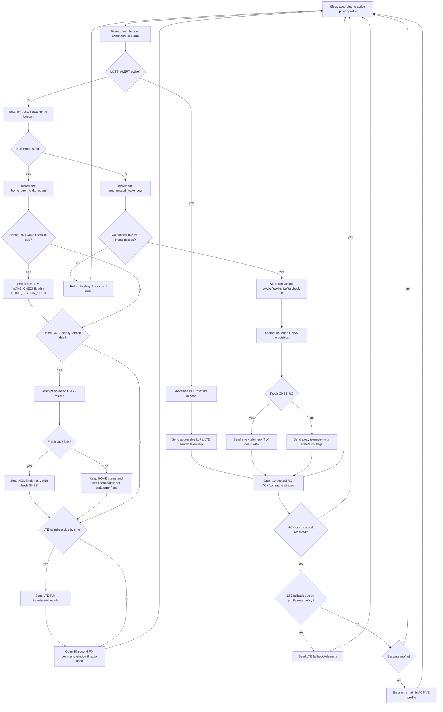

# Bluepaws V4 Collar Runtime Decisions

This document records the agreed high-level runtime behaviour for the Bluepaws V4 collar before the production firmware is implemented.

The current collar test bed is the RAK4631 / nRF52840 + SX1262 LoRa board. The intended production collar keeps the same architectural shape: a low-power collar controller, private LoRa to the Home Hub, and an LTE modem path for direct cloud telemetry or fallback.

## Core runtime principles

- TLV v1.1 is the canonical collar telemetry payload.
- Raw LoRa carries binary TLV only; JSON is never sent over the radio path.
- LTE direct sends the same TLV payload wrapped in an HTTPS JSON envelope.
- The Home Hub receives raw LoRa TLV, base64-encodes the unchanged collar payload, wraps it in HTTPS JSON, and relays it to Supabase.
- BLE Home beacon detection is the primary home/away power gate.
- LoRa/Home behaviour is mainly wake-counter based.
- LTE heartbeat behaviour is time-based because it is an independent cloud communication path.

## Power profile meanings

| Profile | Meaning |
|---|---|
| `POWER_SAVE` | Conservative profile for manual battery saving, low-battery behaviour, or future automatic use for mostly-home cats. |
| `NORMAL` | Default everyday collar profile for most cats. |
| `ACTIVE` | Higher-frequency monitoring for adventurous cats, geofence/distance concern, or user-selected closer watching. This is not an emergency mode. |
| `LOST_ALERT` | Temporary emergency search profile. It uses aggressive LoRa/LTE/BLE behaviour at the cost of battery and should be used only while actively searching. |

## Home profile cadence

When the collar wakes and sees the BLE Home beacon, it remains in the Home path. Home-path cadence is controlled by profile:

| Power profile | Wake interval | Home LoRa wake check-in | Home GNSS sanity refresh | Home LTE heartbeat |
|---|---:|---:|---:|---:|
| `POWER_SAVE` | 30 minutes | Every 2 BLE-home wakes | Every 10 BLE-home wakes | Every 3 hours |
| `NORMAL` | 10 minutes | Every BLE-home wake | Every 10 BLE-home wakes | Every 1 hour |
| `ACTIVE` | 60 seconds | Every BLE-home wake | Every 10 BLE-home wakes | Every 10 minutes |
| `LOST_ALERT` | Emergency cadence | Not governed by normal BLE Home gate | Every cycle if practical | Aggressive emergency cadence |

The Home GNSS sanity refresh exists as a catch-all: even if the collar repeatedly sees the Home beacon, it occasionally proves or refreshes the location assumption.

## BLE Home logic

On each scheduled wake:

1. Scan for the trusted BLE Home beacon.
2. If seen, increment `home_seen_wake_count` and reset or reduce the missed-home state.
3. If missed, increment `home_missed_wake_count`.
4. Do not treat the collar as away after a single missed scan.
5. Only after two consecutive missed BLE Home scans should the collar enter the away path.

If BLE Home is seen and a wake check-in is sent, the packet should explicitly include:

- `status = HOME`
- `tx_reason = WAKE_CHECKIN`
- `HOME_BEACON_SEEN` flag set

`WAKE_CHECKIN` must not automatically mutate packet fields inside the TLV packet builder. The runtime path sets the appropriate status, flags, and reason before building the packet.

## Collar runtime flow

## GNSS failure behaviour

Failed GNSS while the collar is at home is expected, because an indoor collar may be away from GNSS reception.

If BLE Home is seen and a scheduled GNSS sanity refresh fails:

- Keep `status = HOME`.
- Do not erase the previous valid coordinates.
- Do not move the map marker to null or zero coordinates.
- Set stale/error flags as appropriate, such as `STALE_FIX` and/or `ERROR_PRESENT`.
- Backend and UI should treat this as low concern: at home, no fresh GNSS fix.

If BLE Home is not seen and GNSS fails in the away path:

- Do not erase the previous valid coordinates.
- Send telemetry with stale/error flags.
- Let the active power profile decide whether LTE fallback or profile escalation is required.

## Lost Alert behaviour

`LOST_ALERT` is a special safety profile, not simply a faster version of `ACTIVE`.

In Lost Alert:

- The collar is not governed by the normal BLE Home power gate.
- The collar actively advertises a BLE lost/find beacon.
- The Home Hub in portable/off-grid search mode can use BLE RSSI to help pinpoint the collar at close range.
- LoRa and LTE reporting should be aggressive because pet safety is prioritised over battery life.
- Lost Alert should be temporary and user-visible, with clear instruction-manual warnings that it consumes battery quickly.

For early lab builds, the BLE lost/find beacon may include a simple device identifier. Production should replace this with a privacy-preserving rotating identifier that can be resolved only by authorised Bluepaws components.

## Firmware state to track

The collar runtime should track at least:

- `home_seen_wake_count`
- `home_missed_wake_count`
- `last_lora_checkin_at`
- `last_gnss_refresh_at`
- `last_lte_heartbeat_at`
- `last_successful_cloud_seen_at`
- current `status`
- current `power_profile`
- current `tx_reason`

The counter fields drive BLE/Home/GNSS behaviour. Timestamp fields act as LTE scheduling inputs and safety guardrails after reboot, clock changes, or profile transitions.

## Test cases to capture later

- Normal home wake sends `WAKE_CHECKIN` with `HOME_BEACON_SEEN`.
- Normal home GNSS refresh triggers every 10 BLE-home wakes.
- Power Save home LoRa check-in triggers every 2 BLE-home wakes.
- LTE heartbeat is time-based and independent of BLE-home wake count.
- One missed BLE Home scan does not mark the collar away.
- Two consecutive missed BLE Home scans enter the away path.
- Away path sends awake/looking check-in before GNSS acquisition.
- Failed indoor GNSS keeps `HOME` status and does not erase or move the map marker.
- Lost Alert advertises BLE find beacon and increases reporting cadence.
- LTE direct and Home Hub relay both wrap the same unchanged TLV payload for HTTPS ingestion.

## Open details for firmware implementation

The state-machine shape is now fixed, but these details can still be refined during firmware work:

- Exact LoRa ACK retry counts.
- Exact LTE fallback trigger thresholds.
- Exact Lost Alert maximum duration and fallback profile.
- Whether automatic `POWER_SAVE` and automatic `ACTIVE` profile switching are enabled in the first firmware release or held for later.
- Production BLE Home and BLE lost/find beacon authentication and privacy scheme.
